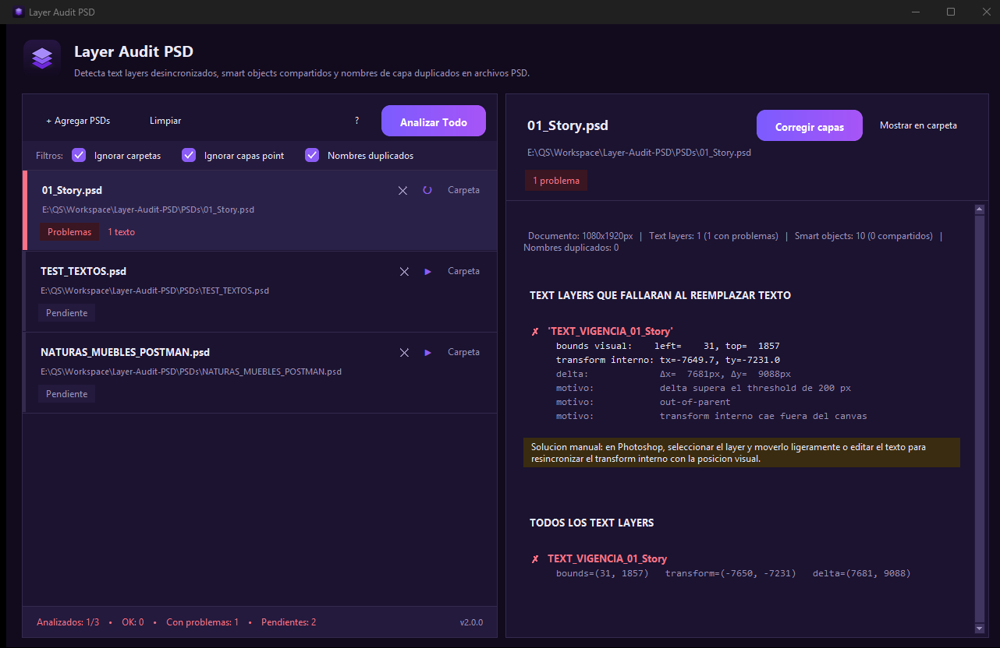
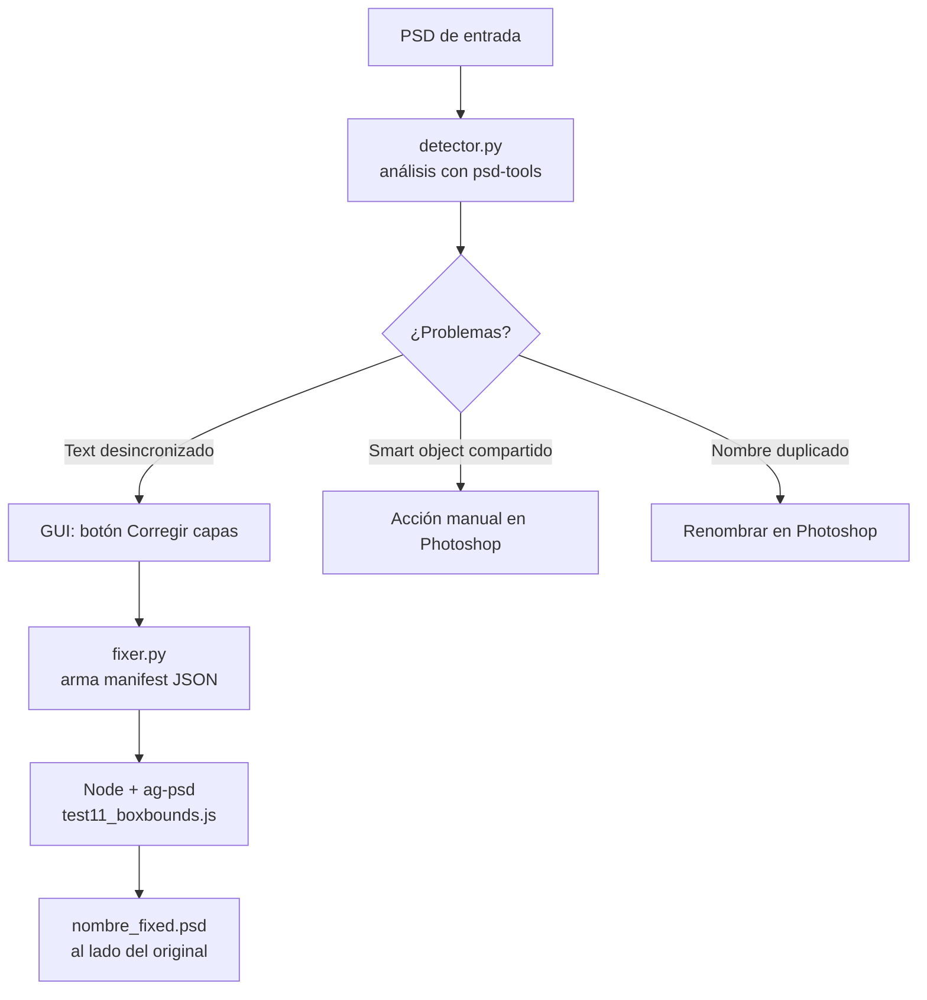

# Layer Audit PSD

**Detecta y repara problemas estructurales en archivos `.psd` / `.psb` que rompen la automatización de Photoshop** cuando los diseñadores entregan plantillas para reemplazo automático de texto e imágenes.

No requiere Photoshop para detectar ni para reparar.



---

## Índice

- [El problema](#el-problema)
- [Qué detecta (3 auditorías)](#qué-detecta-3-auditorías)
- [Cómo funciona por dentro](#cómo-funciona-por-dentro)
- [Cómo decide cada cosa (la lógica de detección)](#cómo-decide-cada-cosa-la-lógica-de-detección)
- [El manifest y la reparación](#el-manifest-y-la-reparación)
- [Instalación](#instalación)
- [Uso](#uso)
- [Compilar el ejecutable](#compilar-el-ejecutable)
- [Estructura del proyecto](#estructura-del-proyecto)
- [Requisitos](#requisitos)
- [Notas y límites conocidos](#notas-y-límites-conocidos)

---

## El problema

Cuando un diseñador arma una plantilla PSD copiando y pegando capas entre *artboards*, Photoshop deja el archivo en un estado que **se ve bien al ojo humano pero está roto para la API de scripting**. Al automatizar el reemplazo de texto/imagen, el resultado sale descuadrado, en el lugar equivocado, o afecta capas que no debía.

Estos daños son **invisibles en Photoshop** (la capa se ve perfecta) y solo aparecen cuando un proceso automático intenta manipular el archivo. Esta herramienta los encuentra **antes** de que lleguen a producción, y repara los que se pueden reparar sin intervención manual.

---

## Qué detecta (3 auditorías)

Las tres se pueden activar/desactivar con los filtros de la barra superior. Todas vienen **activadas por defecto**.

### 1. Text layers desincronizados (transform interno ≠ posición visual)

Al copiar/pegar una capa de texto entre artboards, Photoshop actualiza el **bounds visual** (dónde se ve) pero deja el **transform interno** (`tx`, `ty`) apuntando al artboard **original**. La API de Photoshop reemplaza el texto en las coordenadas del transform → el texto sustituido cae en el lugar equivocado.

> **Se repara automáticamente** con el botón *Corregir capas*.

### 2. Smart objects compartidos (mismo asset embebido)

Cuando se copia un smart object con `Ctrl+C` / `Ctrl+V`, Photoshop crea una capa nueva que **apunta al mismo asset interno** (mismo `unique_id`). Editar uno modifica todas las instancias → la API no puede reemplazar la imagen de uno sin afectar a los demás.

> **Requiere acción manual**: en Photoshop, *Layer → Smart Objects → New Smart Object via Copy* en cada instancia.

### 3. Nombres de capa duplicados (dentro de un mismo artboard)

La automatización y el motor de reparación **buscan las capas por su nombre y usan la primera coincidencia**. Si dos capas comparten nombre dentro del mismo artboard, el nombre deja de identificar una capa única → se edita la capa equivocada.

El ámbito es **por artboard**: que `headline` se repita entre artboards distintos (uno por plataforma) es legítimo y no se marca; solo es problema cuando se repite **dentro del mismo artboard**. Texto y smart objects comparten un mismo espacio de nombres (un texto `logo` y un smart object `logo` en el mismo artboard cuentan como duplicado).

> **Requiere acción manual**: renombrar cada capa para que su nombre sea único dentro del artboard.

---

## Cómo funciona por dentro

La herramienta tiene dos capas que se comunican por un archivo JSON temporal:

- **Detección** → Python puro (`psd-tools`). No necesita Photoshop.
- **Reparación** → Node.js puro (`ag-psd`). No necesita Photoshop.

El PSD reparado siempre se escribe **al lado del original** como `<nombre>_fixed.psd`. **El original nunca se modifica.**



**Por qué este stack:**

- **`psd-tools`** (Python) es la librería madura que entiende el descriptor `TyShO` de capas de texto y el `EngineData` (modelo binario de texto de Adobe). Lee sin escribir, ideal para auditar en paralelo.
- **`ag-psd`** (Node) es la única librería JS que respeta la estructura de los descriptores al **escribir** PSD. Trae un parche imprescindible (`agpsd/patch_ag_psd.js`) que preserva CMYK, el perfil ICC y los `transformPoints` que ag-psd descartaría por defecto.
- **Tkinter** para la interfaz: multiplataforma, sin dependencias extra, con `ProcessPoolExecutor` para analizar lotes grandes sin chocar con el GIL.

---

## Cómo decide cada cosa (la lógica de detección)

Toda la detección vive en `detector.py` y corre sin Photoshop.

### Text layers desincronizados — `check_type_layer`

Compara dos coordenadas de la **misma** capa:

- **Bounds visual** (`layer.left`, `layer.top`): dónde se dibuja la capa. Es la posición **correcta**.
- **Transform interno** (`tx`, `ty` de `layer.transform`): dónde la **API de Photoshop planta el texto** al reemplazarlo. Es lo que puede estar **roto**.

```
delta_x = |tx - left|      delta_y = |ty - top|
```

Se marca como problema con **dos reglas independientes**:

| Regla | Condición | Por qué |
|---|---|---|
| **1. Delta + fuera del padre** | `delta > 200px` **Y** el transform cae fuera del artboard padre por más de `250px` | El texto centrado/derecha tiene deltas grandes legítimos; por eso las dos condiciones deben cumplirse a la vez. |
| **2. Fuera del canvas** | El transform cae fuera del documento por más de `100px` | Pesca coordenadas internas ya inválidas (negativas o más allá del canvas), sin importar el delta. |

```
es_problema = (delta_grande Y fuera_del_padre) O fuera_del_canvas
```

**Casos especiales:**
- **Texto vertical** (`Ornt='Vrtc'`): usa solo el eje X — `ty` puede caer fuera del canvas de forma legítima porque Photoshop guarda ahí la línea base.
- **Texto *point*** (vs *paragraph*): se ignora por defecto. La API lo reposiciona bien aunque el delta sea enorme (`visual = tx + xx·boundingBox.left`, la escala absorbe el offset). Solo el texto *paragraph* rompe la API.
- **Fuente**: se lee de los bytes crudos del PSD (`FontSet`), no del descriptor en vivo, porque Photoshop sustituye la fuente en runtime cuando el transform está corrupto y devolvería un nombre engañoso.

### Smart objects compartidos — `analyze_smart_objects`

Agrupa los smart objects por su `unique_id` (UUID del asset embebido). Cualquier grupo con **2 o más** capas apuntando al mismo UUID es un problema: son instancias enlazadas del mismo asset.

### Nombres duplicados — `analyze_duplicate_names`

1. Junta todas las capas de texto + smart objects.
2. Calcula el **ámbito** de cada capa con `_nearest_artboard` (sube por `.parent` hasta topar con un `Artboard`; si no hay artboard → nivel documento).
3. Agrupa por `(ámbito, nombre)`.
4. Cualquier grupo con **2 o más** capas = nombre duplicado.

Por eso el mismo nombre en artboards distintos **no** se marca, pero repetido dentro de un artboard **sí**.

---

## El manifest y la reparación

El *manifest* es la instrucción que la capa Python le pasa al motor Node: **"la capa llamada X debe quedar en esta caja visual"**.

Se arma en dos pasos:

1. **La GUI** (`gui.py`, `_handle_fix_click`) toma solo las capas marcadas como problema y copia su **bounds visual** (la posición correcta).
2. **`fixer.py`** (`_build_manifest`) lo reduce al formato mínimo y lo escribe en `psd_layers_to_fix.json` (carpeta temporal):

```json
[{ "name": "TEXT_VIGENCIA_01_Story", "left": 199, "top": 939, "right": 812, "bottom": 1010 }]
```

El manifest **no lleva estilos ni transform**: solo el **nombre** (para encontrar la capa) y la **caja visual destino** (la fuente de verdad). El motor Node (`test11_boxbounds.js`) busca la capa por nombre y **reescribe su transform interno** para que apunte a esa caja.

> Aquí se ve por qué los **nombres duplicados** rompen todo: el manifest identifica la capa por nombre, y `findLayerByName` devuelve la **primera** coincidencia. Si el nombre no es único, se repara la capa equivocada.

**Contrato de archivos** (todos en la carpeta temporal del sistema, salvo la salida):

| Archivo | Lo produce | Lo consume | Contenido |
|---|---|---|---|
| `psd_layers_to_fix.json` | `fixer.py` | `test11_boxbounds.js` | `[{name, left, top, right, bottom}]` |
| `psd_fix_log.txt` | `fixer.py` | dev (al fallar) | stdout+stderr del proceso Node + exit code |
| `<nombre>_fixed.psd` | `test11_boxbounds.js` | usuario final | El PSD reparado, al lado del original |

---

## Instalación

Requiere **Python 3.9+** y (solo para reparar) **Node.js 18+**.

```powershell
# Dependencias de detección + interfaz
pip install psd-tools pillow

# Dependencias del motor de reparación (Node)
cd agpsd
npm install
cd ..
```

> `pillow` lo usa la GUI para renderizar el icono, la ilustración de los
> estados vacíos y los botones con degradado.

---

## Uso

### Interfaz gráfica (recomendado)

```powershell
python gui.py
```

1. **+ Agregar PSDs** — carga uno o varios archivos (soporta lotes grandes; procesa en paralelo, uno por core de CPU).
2. **Analizar Todo** — corre las auditorías activas.
3. Selecciona un archivo para ver el desglose completo en el panel de detalles.
4. **Corregir capas** — repara los text layers desincronizados (genera `<nombre>_fixed.psd`). Requiere Node.js.

**Filtros** (barra superior, todos activados por defecto):
- **Ignorar carpetas** — no analiza capas dentro de *Groups* regulares (los Artboards siempre se recorren). Útil porque los grupos suelen tener assets compartidos (logos, legales) que no se automatizan.
- **Ignorar capas point** — no marca texto *point* (la API lo posiciona bien aunque el delta sea grande). Desactívalo para auditar hábitos del equipo.
- **Nombres duplicados** — activa la auditoría de nombres repetidos por artboard.

### Línea de comandos (solo detección)

```powershell
python app.py ruta\al\archivo.psd
python app.py --include-groups ruta\al\archivo.psd   # también entra a los Groups regulares
```

### Reparar sin la GUI

```powershell
cd agpsd
node test11_boxbounds.js <entrada.psd absoluta> <manifest.json> <salida.psd absoluta>
```

> Los paths deben ser **absolutos**: el script de Node corre con `cwd` en `agpsd/`.

---

## Compilar el ejecutable

Genera un ejecutable de escritorio (no requiere Python instalado en la máquina destino):

```powershell
pip install -r requirements-build.txt
python build.py
```

Salida (Windows): `dist/DetectorTextoPSD/DetectorTextoPSD.exe` (formato `--onedir`).

El build incluye los assets (icono), el motor `agpsd/` y `fixer.jsx`, así que **tanto la detección como la reparación funcionan empaquetadas** (la reparación sigue necesitando Node.js instalado en la máquina destino).

Para regenerar el icono: `python assets/make_icon.py`.

---

## Estructura del proyecto

```
Layer-Audit-PSD/
├── gui.py               # Interfaz Tkinter (tema oscuro morado). Entrypoint principal.
├── app.py               # CLI de solo detección.
├── detector.py          # Toda la lógica de análisis (psd-tools). El corazón del proyecto.
├── fixer.py             # Arma el manifest y lanza el motor Node.
├── utils.py             # reveal_in_file_manager, check_node_available.
├── build.py             # Empaquetado con PyInstaller.
├── assets/
│   ├── make_icon.py     # Generador del icono (Pillow).
│   ├── icon.ico/.png    # Icono de la app / ventana / ejecutable.
│   └── logo_header.png  # Logo del header de la GUI.
└── agpsd/
    ├── test11_boxbounds.js  # Motor de reparación activo (ag-psd).
    ├── patch_ag_psd.js      # Parche imprescindible de ag-psd (CMYK, ICC, transforms).
    └── node_modules/        # (npm install)
```

---

## Requisitos

| Componente | Versión | Para qué |
|---|---|---|
| Python | 3.9+ | Detección (GUI y CLI) |
| `psd-tools` | ≥ 1.9.0 | Parseo de PSD |
| Node.js | 18+ | Reparación (botón *Corregir capas*) |
| `ag-psd` | (en `agpsd/`) | Reescritura del PSD |

---

## Notas y límites conocidos

- El original **nunca** se modifica; la reparación siempre escribe una copia `_fixed`.
- Los thresholds de detección (`200px` delta, `250px` fuera del padre, `100px` fuera del canvas) están calibrados contra fixtures reales con texto centrado/justificado. Bajarlos genera falsos positivos.
- La reparación está validada para **texto point y paragraph horizontal**. Los caminos de texto vertical y rotado pasan por el mismo motor pero su corrección aún no está verificada.
- Los smart objects compartidos y los nombres duplicados **no** se reparan automáticamente (requieren decisiones humanas): la herramienta los detecta y explica cómo resolverlos.
- Todos los textos de la interfaz están en español.
